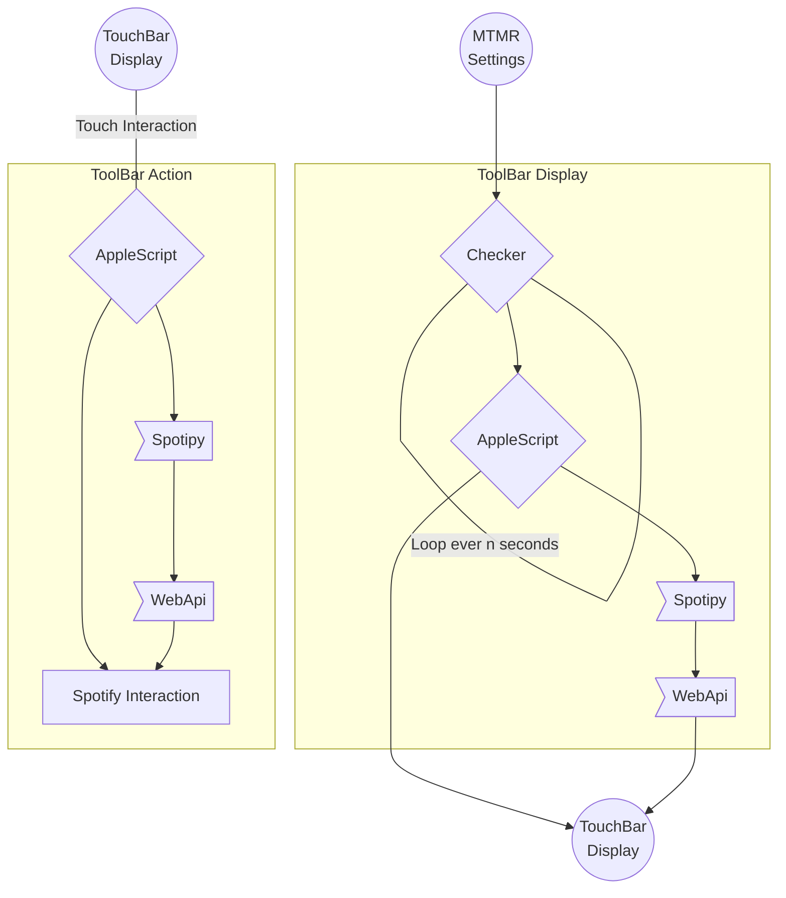
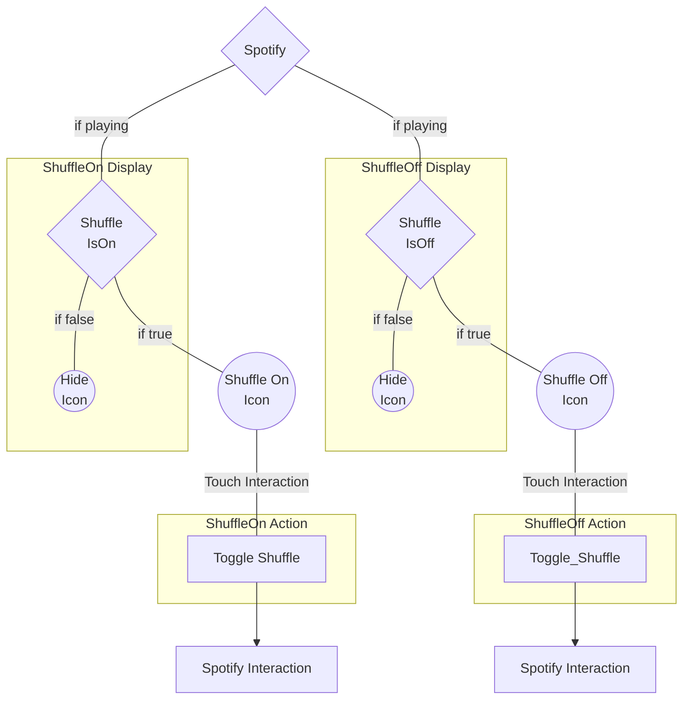
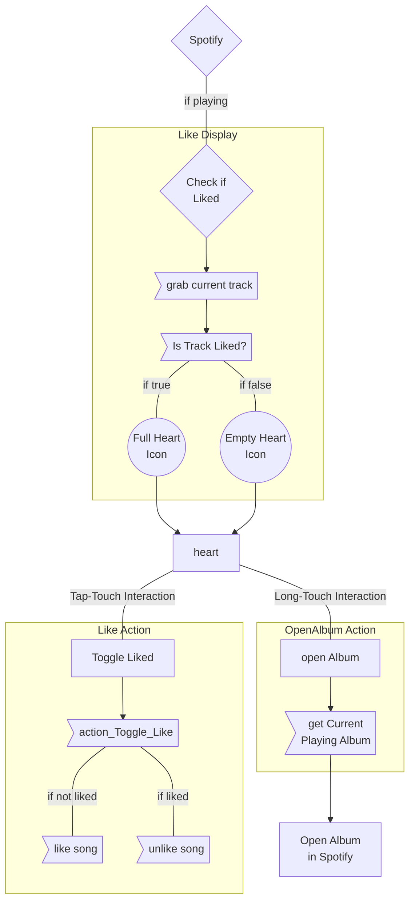
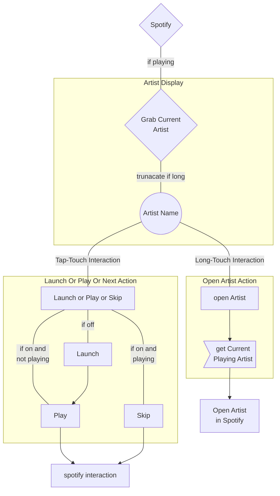
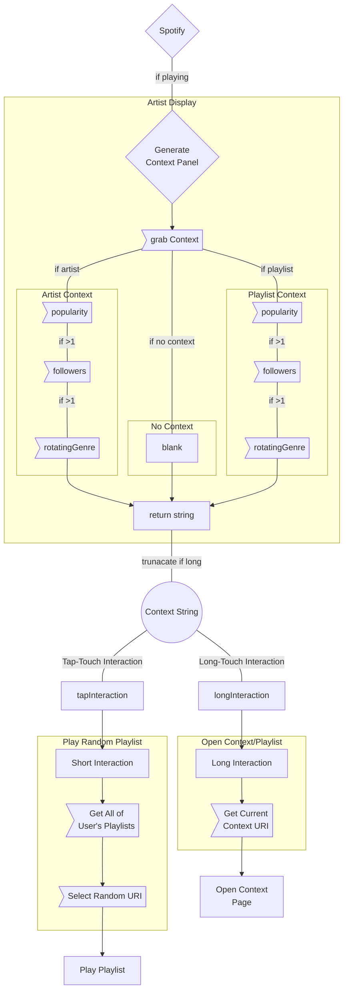

# MacOS TouchBar WebAPI Control Suite
Putting together some stuff using spotipy and mtmr to control spoitify from the macOS touchbar.


## What's even the point?

So last week i smashed the screen of my 2015 macbook Pro (still sour) which led to a replacement which had one of these touch bars that i didn't see much utility in until i saw Better Touch Tools and checked out My Touchbar. My Rules. which got me excited to do something with it and the main thing that i do on my computer, regardless of task, is listen to spotify.

Unfortunately MTMR's custom stuff runs on AppleScript and Spotify doesn't dig that too much, thankfully we can give their WebAPI a reach-around with Python using Spotipy which gives us a more reasonable control to our spotify experience.

Some examples of the difference in access...
||AppleScript|WebAPI||
|---|---|---|---|
|Play/Pause|✓`|✓ |yeah, duh
|Next/Prev Song|✓|✓ |sure
|Song Name|✓|✓|cool
|Artist Name|✓|✓|that's nice
|Like Song|✖|✓|really?
|Playlist/Context Title|✖|✓|bummer
|Follow Counts|✖|✓|lame
|Popularity Stats|✖|✓|dammit
|Listing of Playlists|✖|✓|janet!
|Saving songs to Playlists|✖|✓|bogus.
|Playlist Author|✖|✓|aww

## WTF is going on?

### Shuffle & Repeat Buttons


### Like ♥︎


### Current Artist


### Context Panel (Playlist/Artist)


## Notes
Will add to.
### Changes to files
#### spotipy filepath
all `API_XXX.scpt` files need the `pythonpath` changed to wherever your spotipy installation directory is.
```applescript
set pythonPath to (the POSIX path of (path to home folder)) & "{path to spotipy-master}"
```
#### spotify API creds
