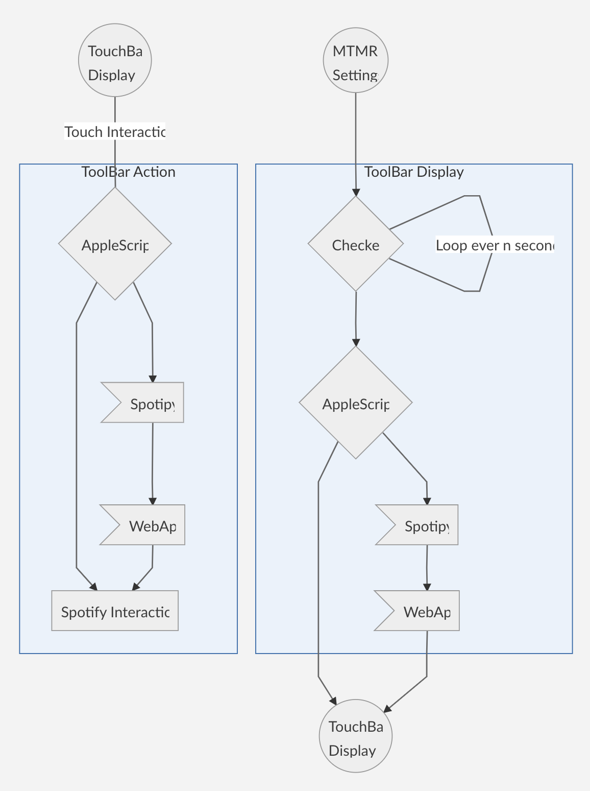
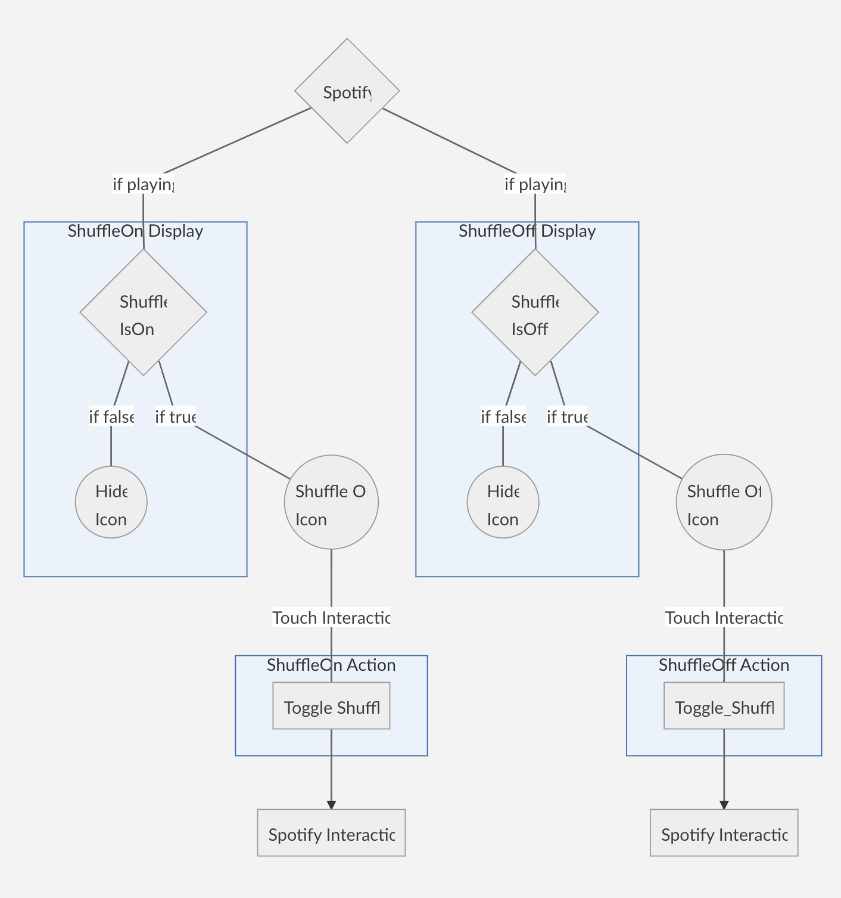
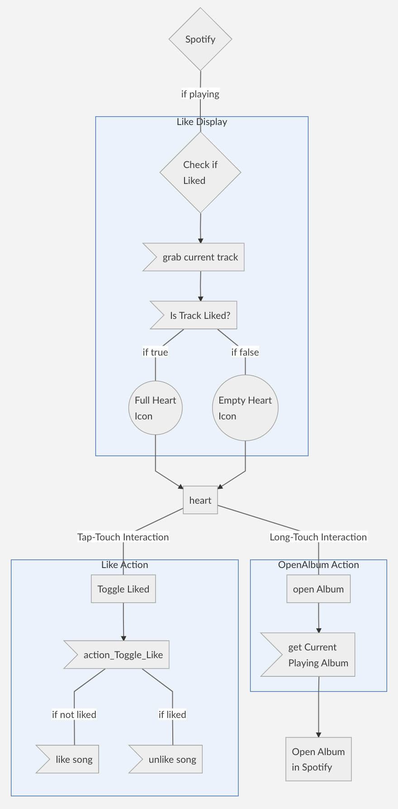
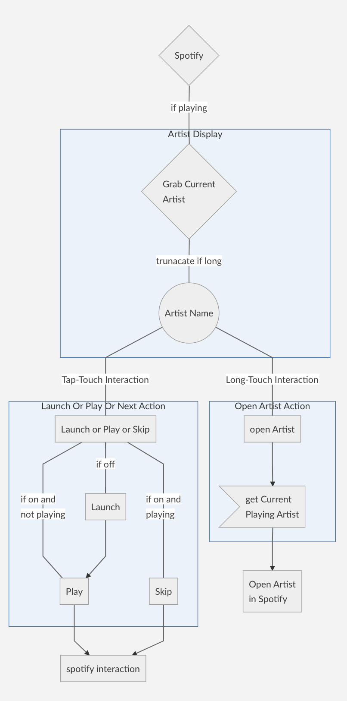
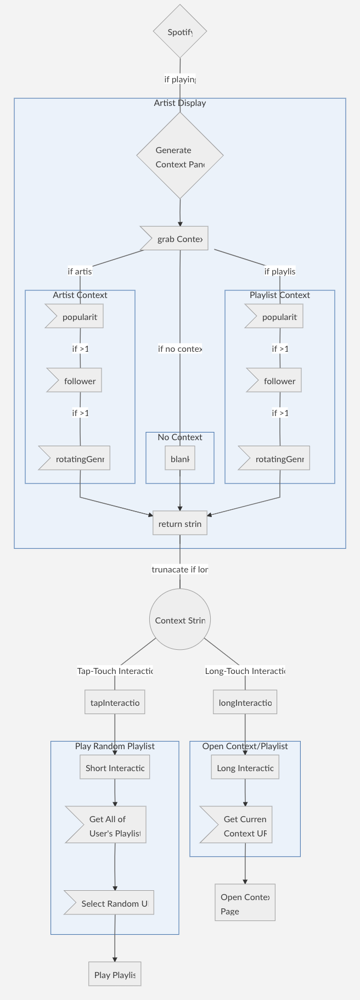

# MacOS TouchBar WebAPI Control Suite

Putting together some stuff using spotipy and mtmr to control spoitify from the macOS touchbar.


>  I want to control spotify from my touchbar if i feel like.<br>
>  I want a simple user experience for quick actions.<br>
>  I am also very... very bored.<br>


- [What's even the point?](#whats-even-the-point)
  * [Access Difference](#access-difference)
- [Context Examples](#context-examples)
  * [Artist](#artist)
  * [Current User Playlist with some followers](#current-user-playlist-with-some-followers)
  * [Current User Playlist with no followers](#current-user-playlist-with-no-followers)
  * [Playlist by some user](#playlist-by-some-user)
  * [Radio](#radio)
  * [Spotify Playlist with a bunch of followers](#spotify-playlist-with-a-bunch-of-followers)
  * [Spotify Playlist with no followers](#spotify-playlist-with-no-followers)
  * [Album](#album)
- [WTF is going on?](#wtf-is-going-on)
- [Install Notes](#install-notes)
  * [Changes to files](#changes-to-files)
    + [spotipy filepath](#spotipy-filepath)
    + [spotify API creds](#spotify-api-creds)
    + [movingFiles](#movingfiles)
 - [Details](#details)
   * [Shuffle & Repeat Buttons](#shuffle--repeat-buttons)
   * [Like ♥︎](#like-%EF%B8%8E)
   * [Current Artist](#current-artist)
   * [Context Panel (Playlist/Artist)](#context-panel-playlistartist)

## What's even the point?

### <a href="https://open.spotify.com/user/12121388895" target="_blank">I ♥︎ spotify duh</a> but also...
So last week i smashed the screen of my 2015 macbook Pro (still sour) which led to a replacement which had one of these touch bars that i didn't see much utility in until i saw Better Touch Tools and checked out My Touchbar. My Rules. which got me excited to do something with it and the main thing that i do on my computer, regardless of task, is listen to spotify.

Unfortunately MTMR's custom stuff runs on AppleScript and Spotify doesn't dig that too much, thankfully we can give their WebAPI a reach-around with Python using Spotipy which gives us a more reasonable control to our spotify experience.
<p align="center">

</p>

### Access Difference
Some examples of the difference in access...

**Ability**|**AppleScript**|**WebAPI**|**Comment**
:-----:|:-----:|:-----:|:-----:
Play/Pause|✓`|✓|yeah, duh
Next/Prev Song|✓|✓|sure
Song Name|✓|✓|cool
Artist Name|✓|✓|that’s nice
Like Song|✖|✓|really?
Playlist/Context Title|✖|✓|bummer
Follow Counts|✖|✓|lame
Popularity Stats|✖|✓|dammit
Listing of Playlists|✖|✓|janet!
Saving songs to Playlists|✖|✓|bogus.
Playlist Author|✖|✓|aww


## Context Examples
> #### Artist
> 

> #### Current User Playlist with some followers
> 

> #### Current User Playlist with no followers
> 

> #### Playlist by some user
> 

> #### Radio
> 

> #### Spotify Playlist with a bunch of followers
> 

> #### Spotify Playlist with no followers
> 

> #### Album
> 

## WTF is going on?
> 

## Install Notes
Will add to, still need to figure out what the easiest way to move it around is. So far i think it's this?
### Changes to files
#### spotipy filepath
all `API_XXX.scpt` files need the `pythonpath` changed to wherever your spotipy installation directory is.
```applescript
set pythonPath to (the POSIX path of (path to home folder)) & "{path to spotipy-master}"
```
#### spotify API creds
this section of `AuthedSpotifyObjectTemplate.py` needs to be filled out and retitled `AuthedSpotifyObject.py`
```python
CLIENT_ID = "{YOUR CLIENT ID}"
CLIENT_SECRET = "{YOUR CLIENT SECRET}"
username = "{YOUR USERNAME}"
```
#### movingFiles
idk what is needed but here is where i'm putting stuff
`Checkers`&`Actions` folders into `Users/Shared/MTMR`
`Spotipy_TouchBar` folder into `.../spotipy` dir.

###  <b>That was fun... i'm bored again.</b>


## Details
> ### Shuffle & Repeat Buttons
> 

> ### Like ♥︎
> 

> ### Current Artist
> 

> ### Context Panel (Playlist/Artist)
> 


#### thanks for reading
here's <b><a href="https://open.spotify.com/user/12121388895" target="_blank">my spotify</a></b> if you wanna listen to stuff.
